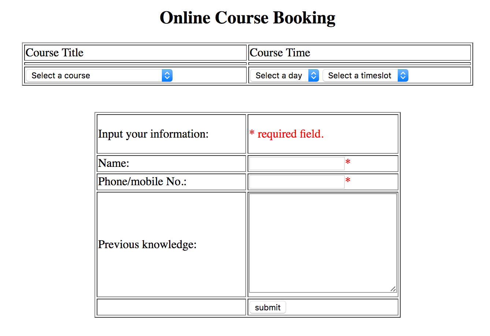

# PHP_SQL_Web
PHP mysql based website for a small assignment project: a booking system, sql operations, php etc.

The snapshot of this web can be found below:

# File Descriptions
* *classes.php*: 
  - the front-end web embedded with php sources codes;
* *DataBase.php*: 
  - the sql operations (create database test, create table courses and booking, insert data, update data, select data;
* *submit.php*: 
  - handling the form submission (checking the string by regular expressions, php injection attack defence).
